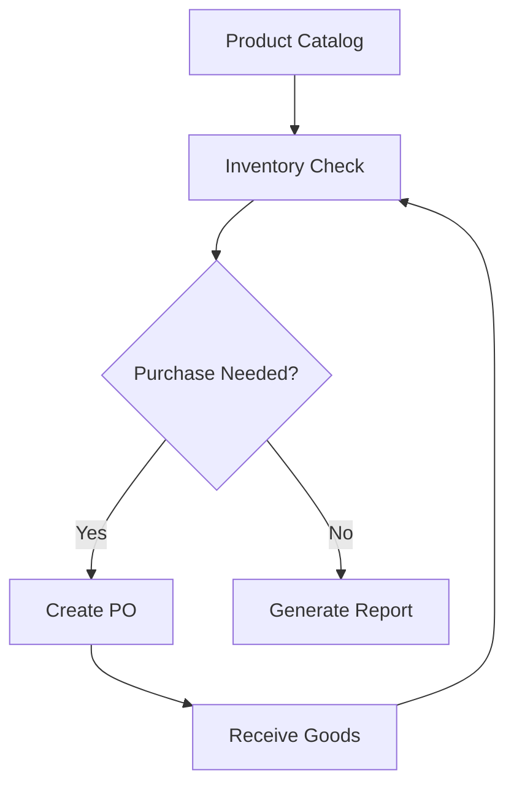

## Overview

Clarity OPS provides a comprehensive platform to manage your entire operations workflow. You can handle products, suppliers, pricing, inventory, and purchase orders from a single dashboard. This guide covers the core features that make operations efficient and scalable.

<Callout kind="info">
  Start with the [dashboard](https://ops.claritylabsbio.com) to access all features. Customize views based on your role.
</Callout>

## Key Features

Discover the essential tools at a glance.

<Columns cols={3}>
  <Card title="Product Catalog" icon="package" href="#product-catalog">
    Organize products with detailed attributes, categories, and images.
  </Card>
  <Card title="Supplier Management" icon="users" href="#suppliers">
    Track suppliers, negotiate pricing, and manage relationships.
  </Card>
  <Card title="Inventory Tracking" icon="database" href="#inventory">
    Monitor stock levels with real-time alerts and reorder points.
  </Card>
  <Card title="Purchase Orders" icon="shopping-cart" href="#purchase-orders">
    Create, approve, and track orders end-to-end.
  </Card>
  <Card title="Reporting" icon="bar-chart-3" href="#reporting">
    Generate insights with customizable dashboards and exports.
  </Card>
</Columns>

## Product Catalog Management

Maintain a centralized product catalog. Add products with SKUs, descriptions, variants, and costs. Use categories and tags for easy searching.

<Expandable title="Advanced Catalog Features" default-open="false">
  Support bulk imports via CSV and API. Integrate with e-commerce platforms for sync.
</Expandable>

## Supplier and Pricing Tools

Manage suppliers and dynamic pricing. Store contact details, contracts, and historical pricing. Set rules for automatic price updates.

<Tabs>
  <Tab title="Add Supplier" icon="plus">
    Navigate to Suppliers > New. Fill in details and save.
  </Tab>
  <Tab title="Update Pricing" icon="edit">
    Select supplier, edit price tiers, and apply changes.
  </Tab>
</Tabs>

## Inventory Tracking and Alerts

Track inventory across warehouses. Set low-stock thresholds to receive email or in-app alerts. Automate reorder suggestions.

```javascript
// Example API call to check inventory
const response = await fetch('https://api.example.com/v1/inventory/{productId}', {
  headers: { Authorization: `Bearer ${YOUR_API_KEY}` }
});
const data = await response.json();
console.log(`Stock: ${data.quantity}`);
```

## Purchase Order Creation and Tracking

Streamline procurement with purchase orders (POs). Create POs from inventory needs, route for approvals, and track deliveries.

<Steps>
  <Step title="Create PO" icon="plus">
    Go to Orders > New Purchase Order.
    
    Select products and supplier.
  </Step>
  <Step title="Approve and Send" icon="check-circle">
    Submit for approval. Email PO to supplier.
  </Step>
  <Step title="Receive Goods" icon="package">
    Update received quantities and close PO.
  </Step>
</Steps>

## Reporting and Analytics Dashboards

Access real-time dashboards for sales, inventory turnover, and supplier performance. Export reports in PDF or CSV.

<CodeGroup tabs="JavaScript,Python">
  ```javascript
  // Fetch dashboard data
  const dashboards = await fetch('https://api.example.com/v1/reports/dashboards');
  ```
  ```python
  # Fetch dashboard data
  import requests
  response = requests.get('https://api.example.com/v1/reports/dashboards')
  ```
</CodeGroup>

<Callout kind="tip">
  Schedule automated reports to run weekly. Use filters for custom views.
</Callout>



This setup ensures you maintain full control over operations while reducing manual work. Explore the dashboard to get started.