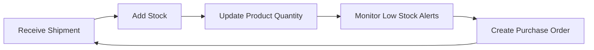

## Prerequisites

Before diving in, ensure you have:

<Callout kind="info">
- A modern web browser like Chrome, Firefox, or Safari
- An email address for account verification
- Basic information about your products and suppliers ready
</Callout>

## Create Your Account

Follow these steps to sign up and access Clarity OPS.

<Steps>
  <Step title="Sign Up" icon="user-plus">
    Visit [https://ops.claritylabsbio.com/register](https://ops.claritylabsbio.com/register) and enter your email, password, and company name.
  </Step>
  <Step title="Verify Email" icon="mail">
    Check your inbox for a verification link and click it to activate your account.
  </Step>
  <Step title="Sign In" icon="log-in">
    Return to [https://ops.claritylabsbio.com/login](https://ops.claritylabsbio.com/login), enter your credentials, and land on the dashboard.
  </Step>
</Steps>

## Dashboard Overview

The dashboard provides quick access to key areas. Use these sections to manage your operations efficiently.

<Columns cols={2}>
  <Card title="Products" icon="package" href="/docs/products">
    View, edit, and track all your inventory items.
  </Card>
  <Card title="Suppliers" icon="truck" href="/docs/suppliers">
    Manage vendor relationships and contact details.
  </Card>
  <Card title="Pricing" icon="dollar-sign" href="/docs/pricing">
    Set dynamic prices and monitor profitability.
  </Card>
  <Card title="Orders" icon="shopping-cart" href="/docs/orders">
    Create purchase orders and track fulfillment.
  </Card>
</Columns>

## Add Your First Product or Supplier

Choose the method that fits your needs.

<Tabs>
  <Tab title="Add Product" icon="package">
    <Steps>
      <Step title="Navigate" icon="search">
        Click **Products** in the sidebar, then **+ New Product**.
      </Step>
      <Step title="Enter Details" icon="edit-3">
        Fill in name, SKU, description, cost, and stock quantity.
      </Step>
      <Step title="Save" icon="save">
        Click **Save** to add it to your inventory.
      </Step>
    </Steps>
  </Tab>
  <Tab title="Add Supplier" icon="truck">
    <Steps>
      <Step title="Navigate" icon="search">
        Go to **Suppliers** > **+ New Supplier**.
      </Step>
      <Step title="Enter Details" icon="edit-3">
        Add name, email, phone, address, and terms.
      </Step>
      <Step title="Save" icon="save">
        Save to enable ordering from this supplier.
      </Step>
    </Steps>
  </Tab>
</Tabs>

## Basic Inventory Workflow

Track stock levels with this simple process:



<Callout kind="tip">
  Set up low-stock alerts in **Settings** > **Inventory** to automate reordering.
</Callout>

## Initial Setup Checklist

<ExpandableGroup>
  <Expandable title="Complete these steps" default-open="true">
    - [ ] Add at least one product and supplier
    - [ ] Configure pricing rules
    - [ ] Set up inventory thresholds
    - [ ] Invite team members via **Users** tab
    - [ ] Review sample purchase order workflow
  </Expandable>
  <Expandable title="Advanced: API Integration">
    Use the API to automate data imports. Example payload for products:
    
````json
{
  "name": "Widget Pro",
  "sku": "WPRO-001",
  "cost": 29.99,
  "stock": 100
}
````
    
    Send to `https://api.example.com/v1/products`.
  </Expandable>
</ExpandableGroup>

## Next Steps

<Columns cols={2}>
  <Card title="Explore Products" icon="package" href="/docs/products" horizontal>
    Dive deeper into product management and bulk imports.
  </Card>
  <Card title="Manage Orders" icon="shopping-cart" href="/docs/orders" horizontal>
    Learn purchase order creation and approvals.
  </Card>
</Columns>

<Callout kind="success">
  You're now ready to manage products, suppliers, pricing, inventory, and orders in Clarity OPS!
</Callout>